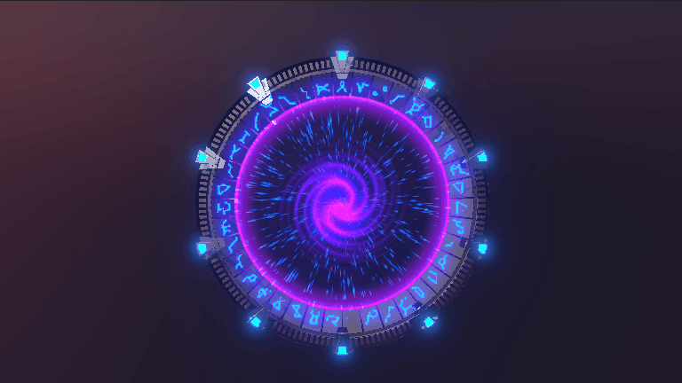
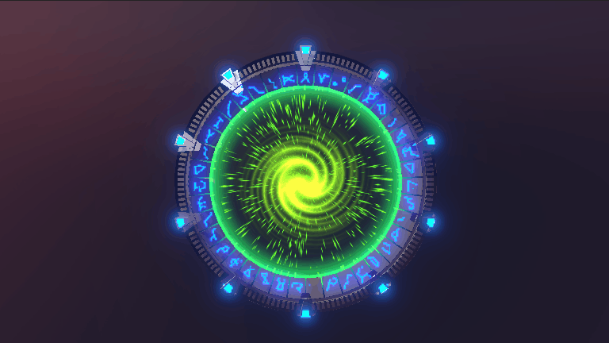

# Visual Effect Graph练习

> Unity版本：2021.3.11f1

## [MagicBall](https://github.com/csdjk/LcL-VisualEffectGraph/tree/master/Assets/Scenes/MagicBall)

## [PortalEffect](https://github.com/csdjk/LcL-VisualEffectGraph/tree/master/Assets/Scenes/PortalEffect)

## [MeshToParticle](https://github.com/csdjk/LcL-VisualEffectGraph/tree/master/Assets/Scenes/MeshToParticle)

